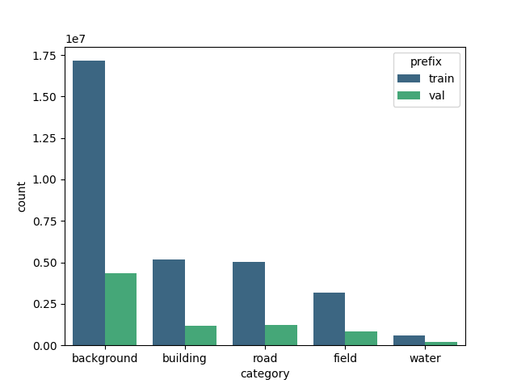

# Supremap Data 
Table of Contents
- [Data Sources](#data-sources)
- [Full Dataset Creation](#full-dataset-creation)
- [Dataset](#dataset)
- [Requirements](#requirements)

This repository has the functionality to 
- Query and download data from [Sentinel](#copernicus-api-and-sentinel) provided by Copernicus API and [Swisstopo](#swisstopo) provided by Swiss Federal Office of Topology.
- Query Open Street Map (OSM) to fetch map data.
- Plot and create segmentation and instance maps of geotagged tifs using OSM API.
- Split the tif files, which are 10,000x10,000 pixels for Swisstopo, into desired patches.
- Preprocess Swisstopo and Sentinel data together to match and align, convert CRS, etc.
- Unified data creation pipeline.
- Downsample or resize images.

## Data Sources
We provide a single entry point `download_data.py` for data download. For all possible options like maximum rows to query or ordering please call `python download_data.py --help`.

### Swisstopo
Swisstopo data download is straightforward. For example the following query will return all images captured at 10cm ground sampling distance (other available option is 2m) from Switzerland from January 1st, 2022 to December 5th, 2022.
Note that date_range argument must form a valid json.
```bash
python download_data.py --swisstopo --bbox "[5,46,10,48]" --date_range "[\"2018-01-01\", \"2018-12-31\"]" \
    --resolution 0.1  --save_dir "../out"
```

One can also query for a single item using the following command. This is useful when the user wants a specific tile or downloads a csv containing list of files from the Swisstopo website.

```bash
python download_data.py --swisstopo --id ID --save_dir "../out"
```

### Copernicus API and Sentinel
10m, 20m, 30m bands from the Sentinel-2 can be downloaded via the following command. For an extensive list of possible commands call the program with `--help`.
```bash
python download_data.py --sentinel --bbox "[5,46,10,48]" --date_range "[\"2022-01-01\", \"2022-01-05\"]" --save_dir "../out"
```
We use the [OpenSearchAPI]((https://scihub.copernicus.eu/twiki/do/view/SciHubUserGuide/OpenSearchAPI)) to query Sentinel data, please note that other options like [Sentinelsat library](https://github.com/sentinelsat/sentinelsat) and AWS are considered but didn't provide the flexibility we require.
See [here](https://scihub.copernicus.eu/userguide/BatchScripting) on the `dhusget.sh` script and [here](https://scihub.copernicus.eu/twiki/do/view/SciHubUserGuide/OpenSearchAPI) for API options.

## Full Dataset Creation
We use the same dataset to train both pix2pixHD and Esrgan models and implemented a pipeline that 
- queries and downloads Swisstopo and Sentinel data along a certain bounding box or point
- fixes alignment issues between two formats
- creates segmentation and instance maps for each tile
- patchifies the tiles (Swisstopo, Sentinel, segmentation map and instance map) into smaller (can be configured, by default 256) png's and saves the corresponding bounding box as a geojson. 

Please see `create_imaginaire_dataset.py` for more details.

### Dataset
We perform the train-test split while creating the data. The total number of pixelwise instances of each class in our final dataset can be seen below:



See some samples from out dataset in [figures folder](figures/data-samples/).


## Requirements
Please download required python packages via
```bash
pip install -r requirements.txt
```

### Copernicus
Sentinel API requires authentication, follow the instructions [here](https://scihub.copernicus.eu/userguide/SelfRegistration) to sign up and add the following lines to your `.bashrc`.
```bash
export DHUS_USER="YOUR_USERNAME"
export DHUS_PASSWORD="YOUR_PASSWORD"
export DHUS_URL="https://apihub.copernicus.eu/apihub"
```

### Install GDAL
If you have difficulty installing GDAL, please try to install through conda-forge.
```bash
conda install -c conda-forge gdal
```